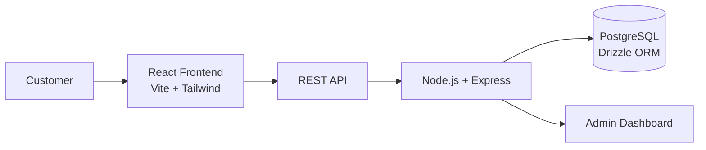
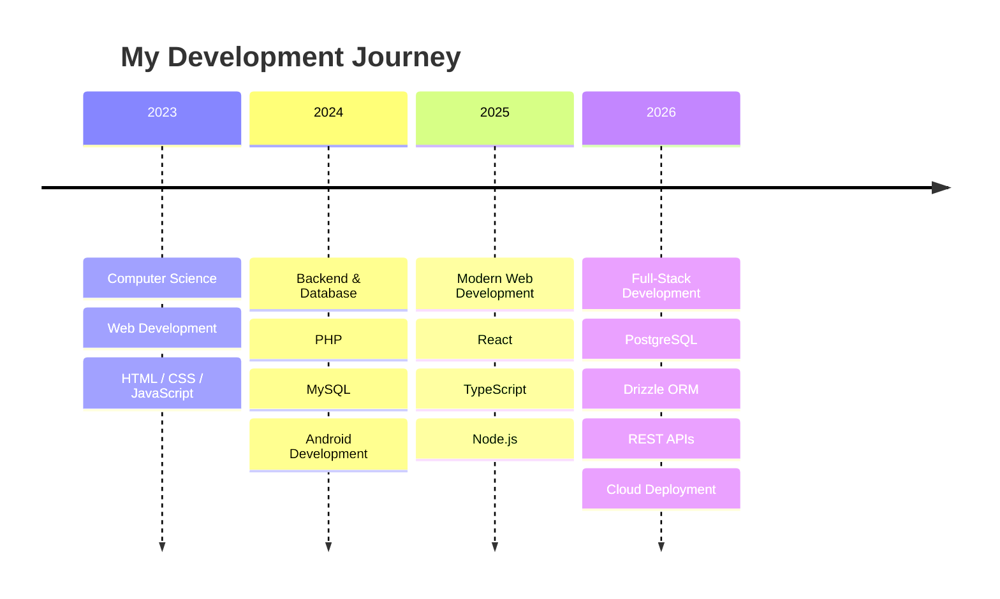
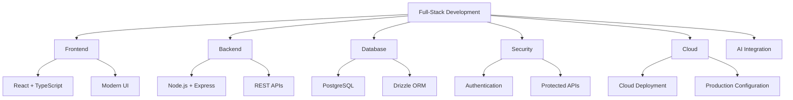
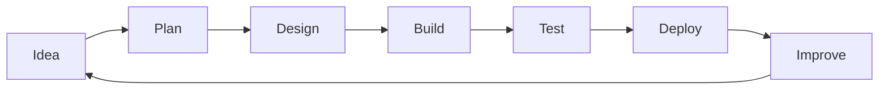
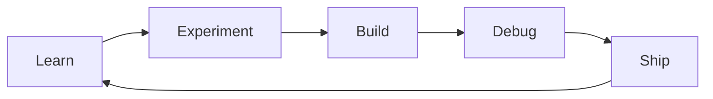
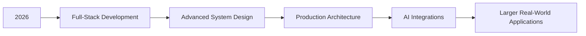

<div align="center">

# SANJAY KUMAR DAHARE

### Computer Science Student · Full-Stack Developer

Building practical web applications with modern technologies.

<br>

<a href="https://github.com/sanjaykumardahare2003-web">
  
</a>

<a href="https://github.com/sanjaykumardahare2003-web?tab=repositories">
  
</a>

<br><br>


</div>

---

## About

I'm a Computer Science student interested in **full-stack development, backend systems, databases, and cloud deployment**.

I enjoy taking an idea from an initial concept to a working application — designing the interface, building the backend, connecting the database, testing the system, and deploying it.

My current focus is on becoming a stronger **full-stack developer** by building real-world projects and improving my understanding of software architecture.

---

# Tech Stack

### Frontend

<p>

</p>

### Backend & APIs

<p>

</p>

### Databases

<p>

</p>

### Tools & Platforms

<p>

</p>

---

# Featured Project

## Mehta Paints & Hardware

**A full-stack digital platform developed for a real-world paint and hardware business.**

The project combines customer-facing features with business management functionality.

### Highlights

- Product catalogue and product management
- Paint shade selection
- Admin dashboard
- Authentication and protected administration
- Order and enquiry management
- WhatsApp-based customer communication
- Business management features
- Responsive user interface
- Progressive Web App support
- Cloud deployment

### Architecture



### Technology

`React` · `TypeScript` · `Tailwind CSS` · `Vite`

`Node.js` · `Express.js` · `PostgreSQL` · `Drizzle ORM`

---

# Other Projects

<table>
<tr>

<td width="50%" valign="top">

### Live Chatbot

A chatbot project exploring conversational interfaces and application integration.

**Stack**

`Python` · `AI` · `Web`

</td>

<td width="50%" valign="top">

### Traffic Violation Application

A web application concept for managing traffic violation information.

**Stack**

`PHP` · `MySQL`

</td>

</tr>

<tr>

<td width="50%" valign="top">

### Scholarship Portal

A modern web application concept focused on scholarship-related workflows.

**Stack**

`React` · `Tailwind CSS`

</td>

<td width="50%" valign="top">

### Android Applications

Mobile applications developed while exploring Android development.

**Stack**

`Java` · `Android Studio`

</td>

</tr>
</table>

---

# Development Journey



---

# What I'm Working On



### Current Priorities

- Build production-ready applications
- Improve backend architecture
- Strengthen database design
- Learn better system design
- Build more real-world products
- Explore practical AI integrations

---

# Development Workflow



---

# GitHub Activity

<div align="center">

<a href="https://github.com/sanjaykumardahare2003-web?tab=repositories">


</a>

<br><br>


</div>

<br>

> My GitHub activity reflects the projects, experiments and ideas I work on over time.

---

# Tech I'm Exploring

| Area | Technologies / Focus |
|---|---|
| Frontend | React, TypeScript, Next.js, Tailwind CSS, Vite |
| Mobile | Flutter, Dart, React Native, Android |
| Backend | Node.js, Express.js, NestJS, Python, FastAPI |
| Databases | PostgreSQL, MongoDB, Redis, Firebase |
| APIs | REST, GraphQL, WebSockets, tRPC |
| AI & GenAI | Python, LLM APIs, RAG, AI Agents, LangChain |
| DevOps | Docker, Kubernetes, GitHub Actions, CI/CD |
| Cloud | AWS, Vercel, Cloudflare, Serverless |
| Architecture | System Design, Microservices, Distributed Systems |
| Security | OAuth, JWT, Authentication, Authorization, API Security |
| Testing | Jest, Vitest, Playwright, Postman |
| Developer Tools | Git, GitHub, VS Code, Linux, npm, pnpm |
---

### Learning Radar

`Next.js` · `Flutter` · `Dart` · `React Native` · `NestJS`
`FastAPI` · `MongoDB` · `Redis` · `GraphQL` · `Docker`
`Kubernetes` · `AWS` · `Cloudflare` · `GitHub Actions`
`Python` · `LLMs` · `RAG` · `AI Agents` · `LangChain`
`System Design` · `Microservices` · `Playwright`

# Developer Workflow



---

# Developer Terminal

```bash
$ whoami

Sanjay Kumar Dahare

$ role

Computer Science Student

$ focus

Full-Stack Development

$ frontend

React / TypeScript / Tailwind

$ backend

Node.js / Express

$ database

PostgreSQL

$ current_status

Building & Learning

$ next

Build something useful.
```

---

# Roadmap



### Progress

- ✓ Modern Web Development
- ✓ Full-Stack Applications
- ✓ Relational Databases
- ✓ Cloud Deployment
- → Advanced System Design
- → Production Architecture
- → AI Integrations
- → Larger Real-World Applications

---

# Let's Connect

<div align="center">

<a href="https://github.com/sanjaykumardahare2003-web">


</a>

<a href="https://github.com/sanjaykumardahare2003-web?tab=repositories">


</a>

<br><br>

**Open to learning, building and collaborating on interesting projects.**

</div>

---

<div align="center">

### Build. Learn. Ship. Improve.

<br>


</div>
